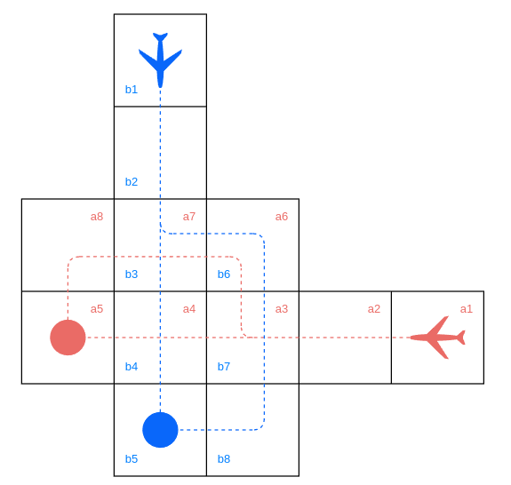

# Air Traffic Control

This scenrio extends the previous obstacle avoidance example to include a more complicated state space.

For this scenario we will consider two identical aircraft navigating to separate destinations. The aircraft intially travel perpendicularly to one another, and start at an equal distance from their respective destinations.

## A Visualisation of the Environment

### Behavior of the Aircrafts

Each aircraft is restricted to two potential trajectories, with each intersecting with those of the other aircraft.