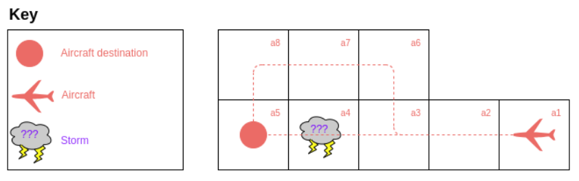
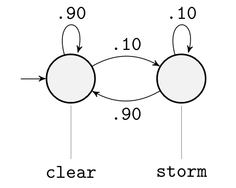

# model_c - Simple Obstacle Avoidance Problem

An aircraft is travelling along a planned trajectory at a constant rate. The planned trajectory, $T$, follows locations $[a_1,a_2,a_3,a_4,a_5]$ without making any maneuvers, which is the optimal path from initial location, $a_1$, to destination, $a_5$.

There is a certain probability that a storm will occur along the planned trajectory (in location $a_3$), making the planned trajectory dangerous for air travel. In this case, the aircraft should maneuver to follow a safe trajectory, $T'$. This alternate trajectory traverses locations $[a_1,a_2,a_3,a_6,a_7,a_8,a_5]$.

In order to minimize cost, trajectory $T$ should always be preferred unless there is a storm.

## A visualization of the environment:

## The behavior of the airspace in $a_4$ is defined by a DTMC as follows:

The skies initially are clear. A storm may appear at any time. The sky will tend to maintain its state with high probability.

## The behavior of the aircraft is defined by a MDP as follows:

This aircraft has 2 actions at its disposal: *go*, and *turn*.

*go* is a simple action which allows the aircraft to continue on its current trajectory. *go* is enabled in every state (except the destination, where all actions are disabled).

*turn* is an action that allows the aircraft to change its trajectory. *turn* is only enabled in $a_3$ to allow the aircraft to maneuver around the storm.

It is assumed that a turn results in a sub-optimal trajectory (from a cost perspective) due to increased distance traveled by the aircraft. Therefore the aircraft should tend not to turn unless there is an obstacle blocking its path.

## Specifications

LTL specifications can be checked for this model using **PRISM model checker**.

For an LTL specification, $\phi$, the expression **Pmax?=$\phi$** is a PRISM property which can be analyzed by the **PRISM model checker**. The result of this computation will be a *policy* which resolves the determinism of the parallely-composed MDP in order to maximize probability of satisfying $\phi$.

Specifications are given in `model_c.specs`.

**Example LTL specifications for this model:**
> Aircraft always reaches its destination ($a_5$)

$G [F(a_5)]$

> Aircraft never enters storm

$G [!(storm \land a_4)]$

> Aircraft never turns except to avoid a storm

$G [X(a_6) \implies storm]$

These LTL specifications can be given to PRISM model checker along with the model to check these properties

**Pmax?=**