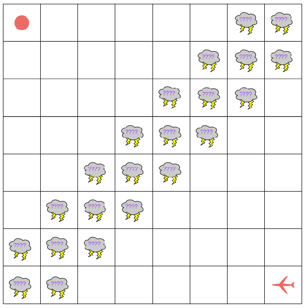

# "Through the Storm"

This scenrio extends each of the previous air traffic control examples to further illustrate the utility of probabilistic analysis.

For this scenario we will consider a single aircraft navigating to its destination. This aircraft will exist in an 8x8 environment with no strict route to the destination. 

Also present in the environment is a large storm cell which will initially block the entire airspace between the aircraft and its destination. Behavior of this storm cell will be explained in later sections.

## A Visualisation of the Environment

### Behavior of the Aircraft
The aircraft will be capable of executing actions [go, turn_left, turn_right] to navigate through the environment.

### Behavior of the Storm Cell
**For the purposes of this experiment we will make some unrealistic assumptions about the behavior of a storm.**
Firstly, the whole storm is divided into individual cells which are each indepenendent markovian processes. This means the behavior of each unit is unaffected by the behavior of any other unit. 

Each storm may move up, down, left, right, disappear, or reappear at each time step. Storm cells may collide, allowing multiple cells to exist in the same space. This will represent a more intense storm which the  

Each individual cell (and the aircraft) are synchronized so each entity must make a state transition for each time step.

Lets assume an aircraft can only sustain itself in a storm for 2 consecutive timesteps. If that duration is exceeded, the aircraft will crash.

